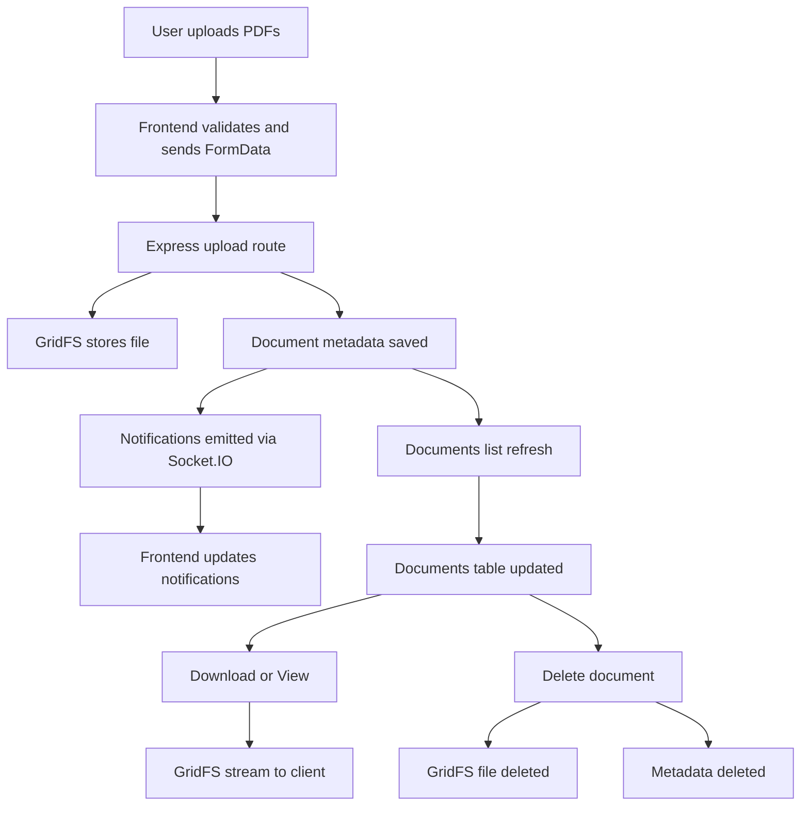

# Document Management Dashboard

## Project Setup Instructions

1. Create a `server/.env` file and set your MongoDB connection string.
	- Example: `MONGO_URI=mongodb+srv://<user>:<password>@<cluster>/<db>?retryWrites=true&w=majority`
2. Install dependencies for both the backend and frontend:

```bash
npm run install:all
```

3. Start the backend server:

```bash
npm run server
```

4. Start the frontend app:

```bash
npm run client
```

## Run/Build Commands

Root scripts:

```bash
npm run install:all
npm run server
npm run client
```

Frontend (Vite):

```bash
cd frontend
npm run dev
npm run build
npm run preview
npm run test
```

Backend (Node/Express):

```bash
cd server
npm run dev
npm run start
npm test
```

## Deployment Instructions

1. Build the frontend:

```bash
cd frontend
npm run build
```

2. Set environment variables on your server:

- `MONGO_URI` (MongoDB connection string)
- `PORT` (optional, defaults to 5000)

3. Start the backend:

```bash
cd server
npm run start
```

4. Serve the frontend build from a static host (Netlify/Vercel/S3) or your web server.

If hosting frontend and backend on different origins, update the frontend API base URL in [frontend/src/services/api.js](frontend/src/services/api.js).

## Technologies Used

Backend:
- Node.js
- Express
- MongoDB Atlas
- Mongoose
- GridFS
- Socket.IO
- Multer
- Jest
- Supertest

Frontend:
- React
- Vite
- React Router
- Tailwind CSS
- Axios
- React Hot Toast
- Socket.IO Client
- Vitest
- React Testing Library

## Assumptions and Notes

- The backend reads `MONGO_URI` from `server/.env` and expects MongoDB Atlas (or a compatible MongoDB instance).
- GridFS is used for file storage and the bucket name is `documents`.
- Default ports are `5000` for the backend and `5173` for the frontend unless overridden.
- Uploads accept PDF files only and enforce a 20MB per-file limit.

## Workflow


